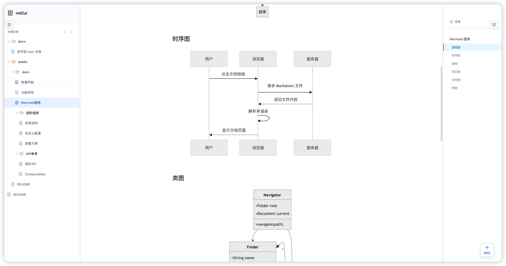

# md2ui

一个轻量级的文档渲染系统，将本地 Markdown 文档转换为美观的 HTML 页面。

## 核心特性

- 自动化目录 - 扫描文档文件夹，自动生成多级导航树
- 三栏布局 - 左侧导航、中间内容、右侧大纲
- Markdown 增强 - 支持 GFM 语法、代码高亮、Mermaid 图表
- 交互优化 - 可拖拽调整宽度、折叠侧边栏、阅读进度显示

## 效果图



## 安装使用

### 从 npm 安装（推荐）

```bash
npm install -g md2ui
```

### 使用方法

在包含 `.md` 文件的目录下运行：

```bash
cd /path/to/your/docs
md2ui
```

指定端口：

```bash
md2ui -p 8080
```

访问 http://localhost:3000 查看文档（默认端口 3000）。

### 文档组织

```
your-docs/
├── README.md              # 首页内容
├── 00-快速开始.md
├── 01-功能特性.md
└── 02-进阶指南/
    ├── 01-目录结构.md
    └── 02-自定义配置.md
```

文件命名规则：
- 使用 `序号-名称.md` 格式控制排序，如 `01-快速开始.md`
- 文件夹也支持序号前缀，如 `02-进阶指南/`
- 序号越小越靠前

## 开发维护

如果你想参与开发或自定义功能：

### 环境准备

```bash
# 克隆项目
git clone https://github.com/user/md2ui.git
cd md2ui

# 安装依赖
pnpm install
```

### 开发模式

```bash
pnpm dev
```

访问 http://localhost:3000，修改代码后自动热更新。

### 本地测试 CLI

```bash
# 安装到全局
npm install -g .

# 在任意目录测试
cd /path/to/test/docs
md2ui
```

### 项目结构

```
md2ui/
├── bin/md2ui.js           # CLI 入口
├── src/
│   ├── App.vue            # 主组件
│   ├── api/docs.js        # 文档列表获取
│   ├── components/        # Vue 组件
│   └── composables/       # 组合式函数
├── public/docs/           # 示例文档
└── vite.config.js         # Vite 配置
```

### 发布新版本

参考 [发布文档](docs/发布到%20npm%20仓库.md)

## 许可证

MIT License
