# md2ui

[](https://www.npmjs.com/package/md2ui)
[](https://github.com/devsneed/md2ui)
[](LICENSE)

一个轻量级的 Markdown 文档渲染工具，将本地 `.md` 文件转换为美观的 HTML 页面。支持实时预览和静态站点生成（SSG）两种模式。

## 功能特性

- 自动目录树 - 扫描文档文件夹，自动生成多级导航，支持搜索过滤
- 三栏布局 - 左侧导航 / 中间内容 / 右侧大纲，可拖拽调整宽度
- Markdown 增强 - GFM 语法、代码高亮、Mermaid 图表、Frontmatter
- 全文搜索 - 基于 MiniSearch 的快速全文检索
- 暗色模式 - 一键切换亮色/暗色主题
- 移动端适配 - 响应式布局，抽屉式导航和目录
- 阅读体验 - 阅读进度条、预计阅读时间、上下篇导航
- SSG 构建 - `md2ui build` 生成纯静态 HTML，可直接部署
- PWA 支持 - 离线访问能力
- 自定义配置 - 站点标题、主题色、GitHub 链接、页脚等

## 效果预览

### 全文搜索

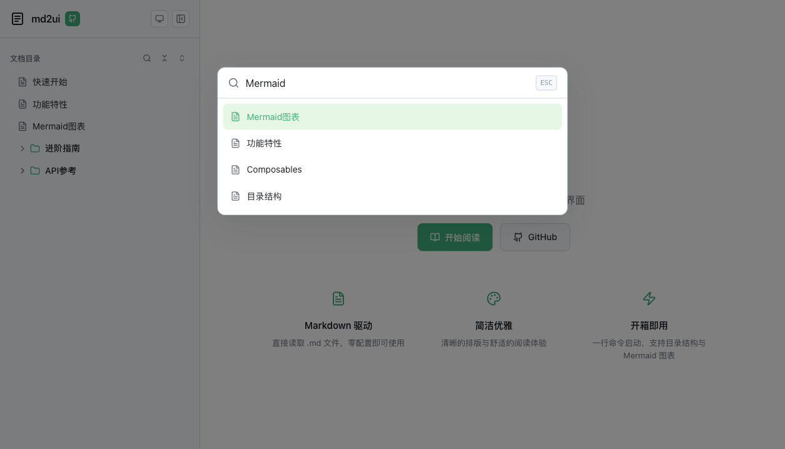

### 代码高亮

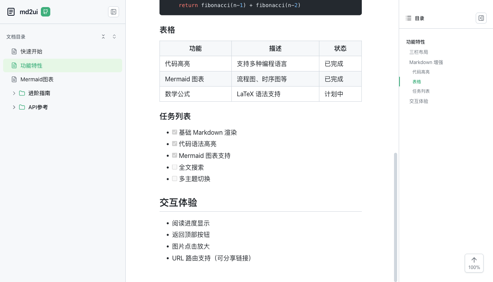

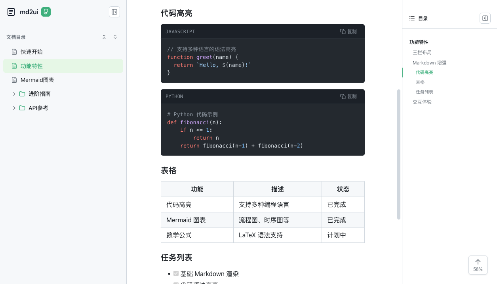

### 暗色模式

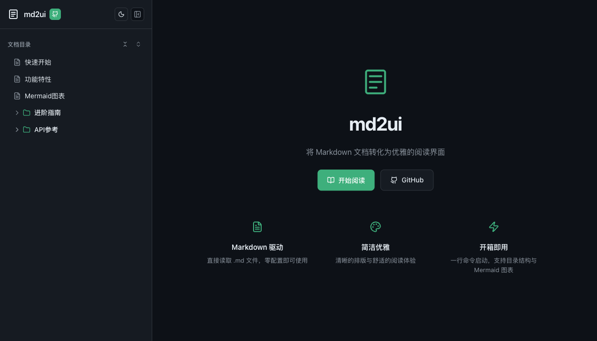

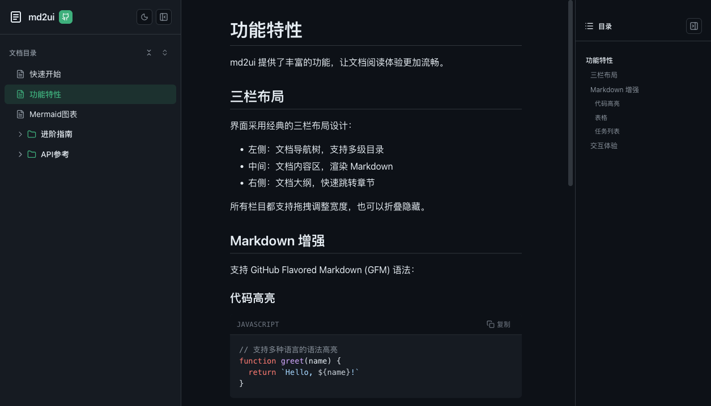

### 移动端适配

<p>
  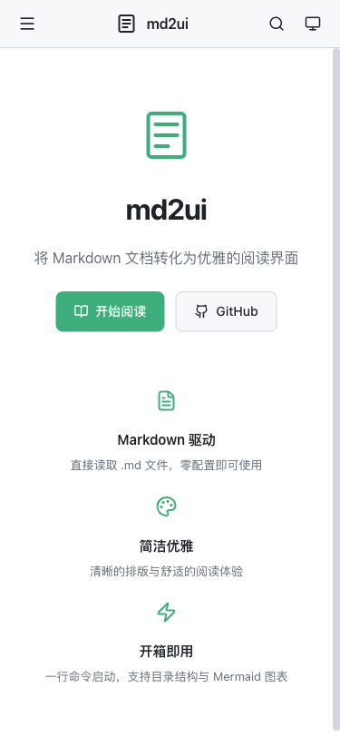
  
  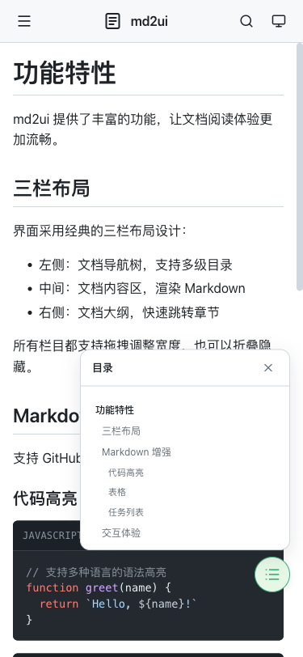
</p>

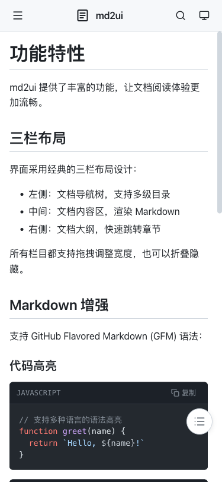

### 上下篇导航

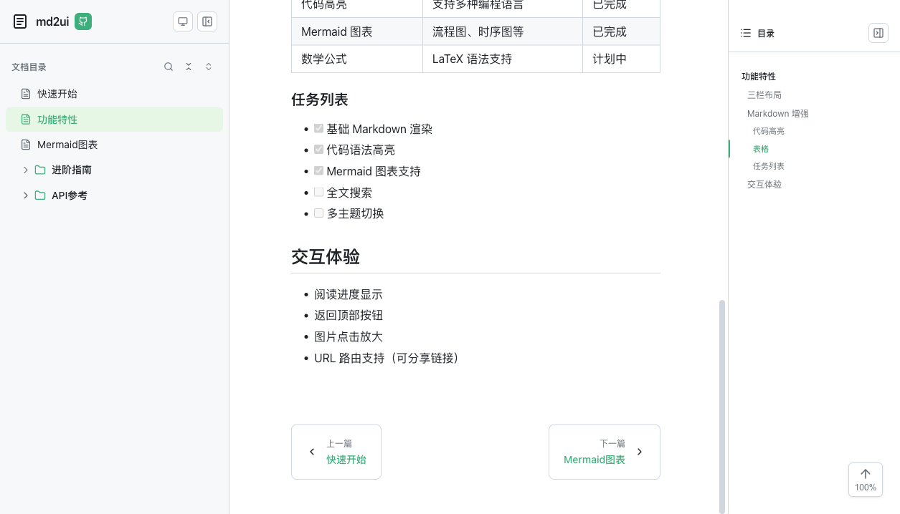

### 阅读时间

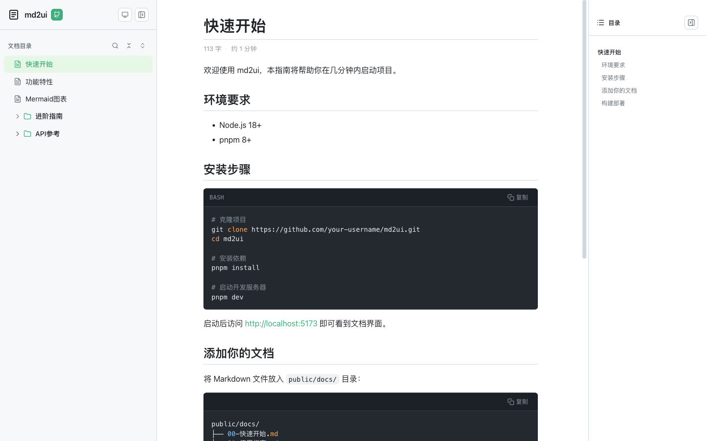

### Frontmatter 支持

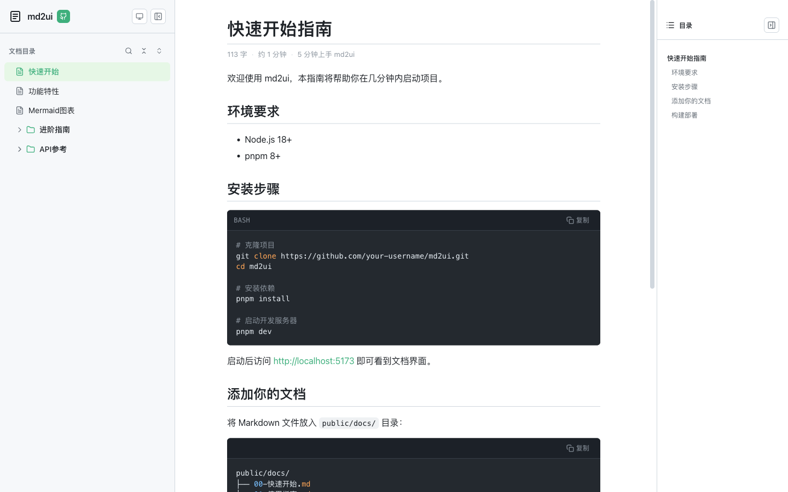

### 导航过滤


### SSG 静态构建

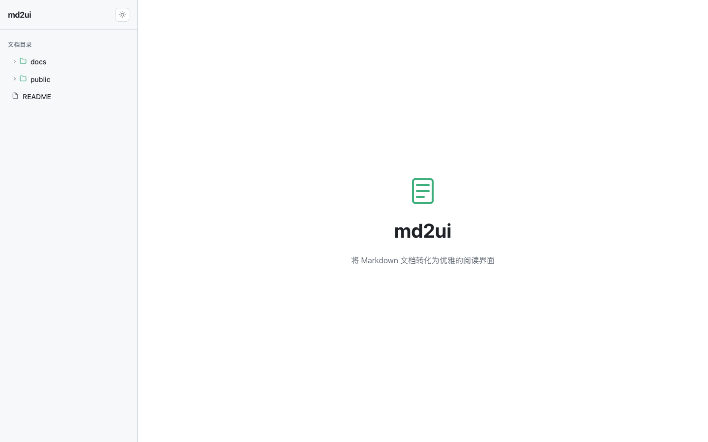

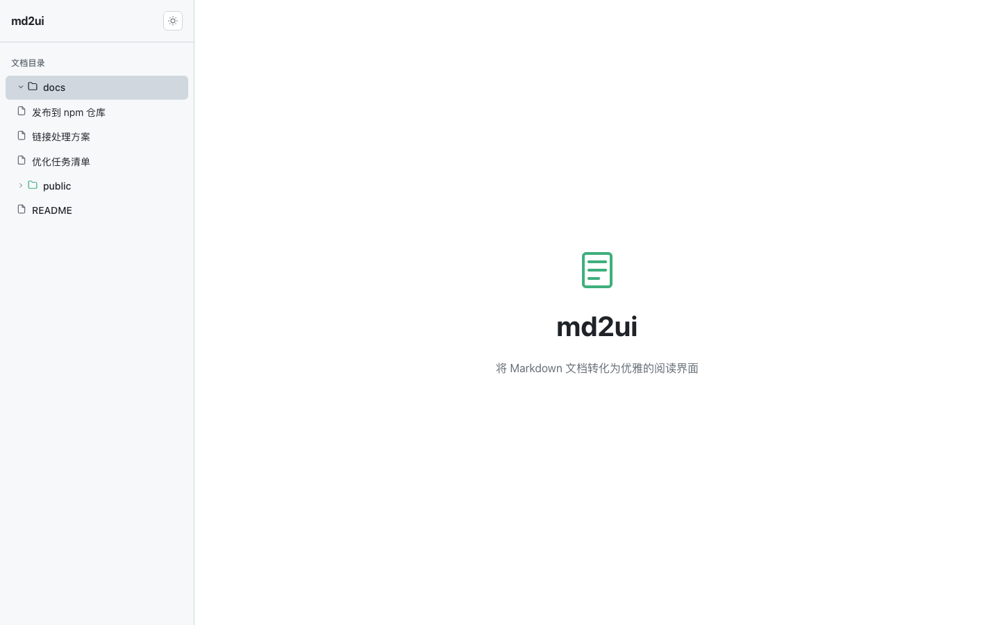

## 安装使用

### 全局安装

```bash
pnpm add -g md2ui
# 或
npm install -g md2ui
```

### 实时预览

在包含 `.md` 文件的目录下运行：

```bash
cd /path/to/your/docs
md2ui
```

指定端口：

```bash
md2ui -p 8080
```

访问 http://localhost:3000 查看文档（默认端口 3000）。

### 静态构建

```bash
md2ui build
```

生成的静态文件在 `dist/` 目录下，可直接部署到任意静态服务器。

## 文档组织

```
your-docs/
├── README.md              # 首页内容
├── 00-快速开始.md
├── 01-功能特性.md
└── 02-进阶指南/
    ├── 01-目录结构.md
    └── 02-自定义配置.md
```

- 使用 `序号-名称.md` 格式控制排序，如 `01-快速开始.md`
- 文件夹也支持序号前缀，如 `02-进阶指南/`
- 序号越小越靠前

## 自定义配置

在文档目录下创建 `md2ui.config.js` 或 `.md2uirc.json`：

```js
// md2ui.config.js
export default {
  title: '我的文档站',
  port: 8080,
  folderExpanded: true,
  themeColor: '#3eaf7c',
  github: 'https://github.com/your/repo',
  footer: 'Copyright © 2025'
}
```

| 配置项 | 类型 | 默认值 | 说明 |
|--------|------|--------|------|
| title | string | `'md2ui'` | 站点标题 |
| port | number | `3000` | 开发服务器端口 |
| folderExpanded | boolean | `false` | 文件夹默认展开 |
| themeColor | string | `'#3eaf7c'` | 主题色 |
| github | string | `''` | GitHub 仓库链接 |
| footer | string | `''` | 页脚内容 |

## 开发

```bash
git clone https://github.com/devsneed/md2ui.git
cd md2ui
pnpm install
pnpm dev
```

### 项目结构

```
md2ui/
├── bin/
│   ├── md2ui.js           # CLI 入口（dev server）
│   └── build.js           # SSG 静态构建
├── src/
│   ├── App.vue            # 主组件
│   ├── api/docs.js        # 文档列表获取
│   ├── components/        # Vue 组件
│   ├── composables/       # 组合式函数
│   ├── config.js          # 共享配置
│   └── style.css          # 全局样式
├── public/docs/           # 示例文档
└── vite.config.js         # Vite 配置
```

### 发布新版本

参考 [发布文档](docs/发布到%20npm%20仓库.md)

## 许可证

MIT License
