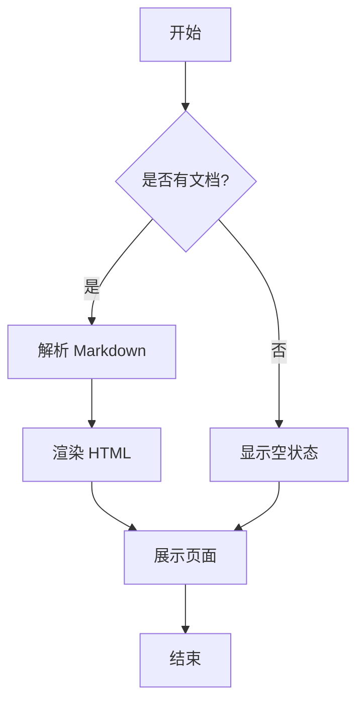
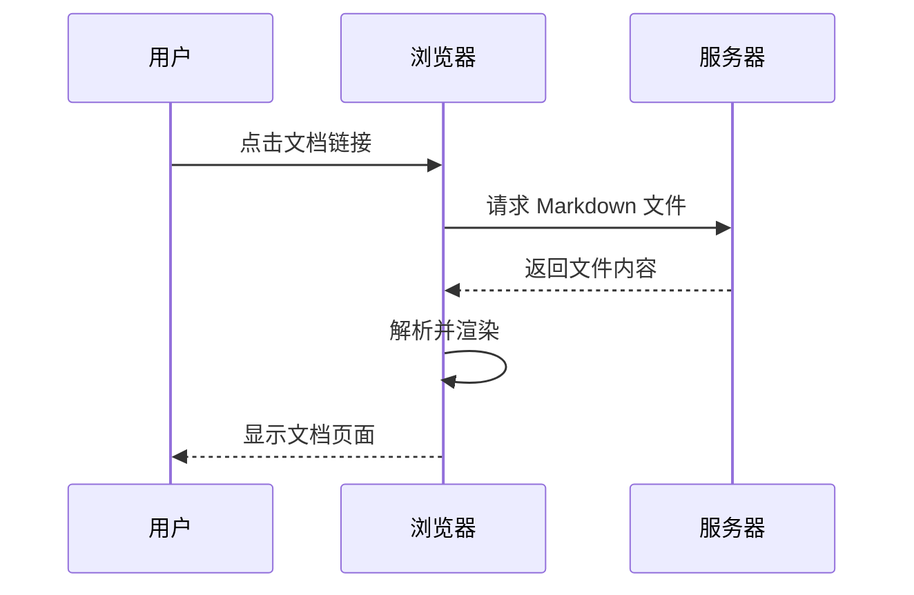
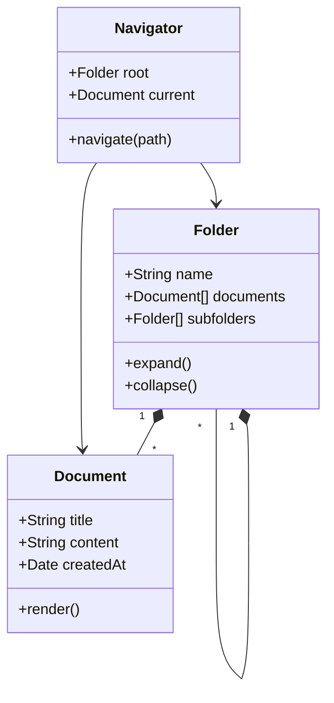
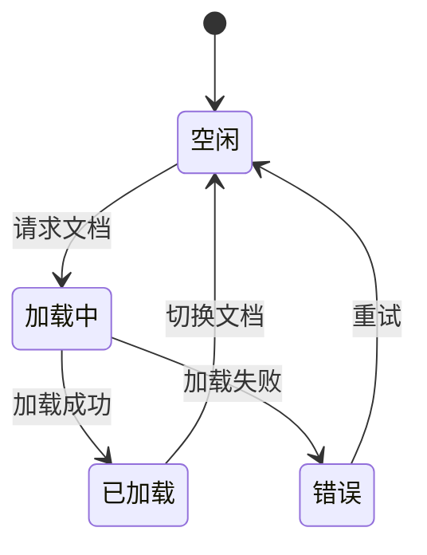
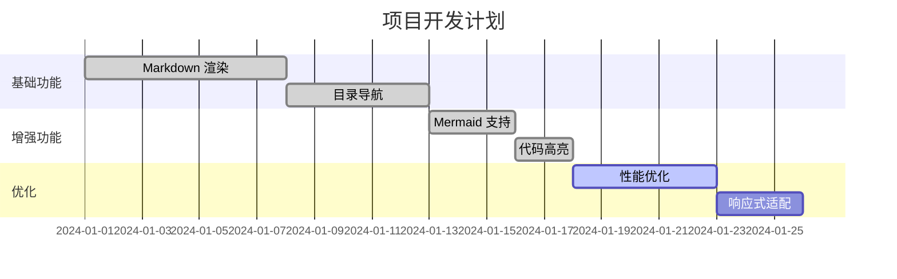
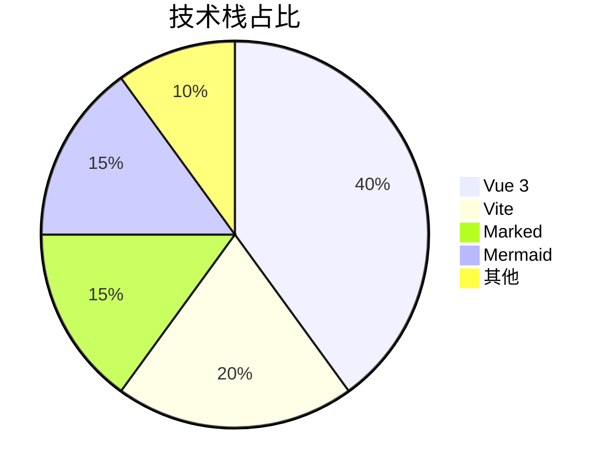

# Mermaid 图表

md2ui 内置了 Mermaid 支持，可以直接在 Markdown 中绘制各类图表。

## 流程图

```mermaid
flowchart TD
    A[开始] --> B{是否有文档?}
    B -->|是| C[解析 Markdown]
    B -->|否| D[显示空状态]
    C --> E[渲染 HTML]
    E --> F[展示页面]
    D --> F
    F --> G[结束]
```

## 时序图

```mermaid
sequenceDiagram
    participant U as 用户
    participant B as 浏览器
    participant S as 服务器
    
    U->>B: 点击文档链接
    B->>S: 请求 Markdown 文件
    S-->>B: 返回文件内容
    B->>B: 解析并渲染
    B-->>U: 显示文档页面
```

## 类图

```mermaid
classDiagram
    class Document {
        +String title
        +String content
        +Date createdAt
        +render()
    }
    
    class Folder {
        +String name
        +Document[] documents
        +Folder[] subfolders
        +expand()
        +collapse()
    }
    
    class Navigator {
        +Folder root
        +Document current
        +navigate(path)
    }
    
    Folder "1" *-- "*" Document
    Folder "1" *-- "*" Folder
    Navigator --> Folder
    Navigator --> Document
```

## 状态图

```mermaid
stateDiagram-v2
    [*] --> 空闲
    空闲 --> 加载中: 请求文档
    加载中 --> 已加载: 加载成功
    加载中 --> 错误: 加载失败
    已加载 --> 空闲: 切换文档
    错误 --> 空闲: 重试
```

## 甘特图

```mermaid
gantt
    title 项目开发计划
    dateFormat  YYYY-MM-DD
    section 基础功能
    Markdown 渲染     :done, a1, 2024-01-01, 7d
    目录导航          :done, a2, after a1, 5d
    section 增强功能
    Mermaid 支持      :done, b1, after a2, 3d
    代码高亮          :done, b2, after b1, 2d
    section 优化
    性能优化          :active, c1, after b2, 5d
    响应式适配        :c2, after c1, 3d
```

## 饼图

```mermaid
pie title 技术栈占比
    "Vue 3" : 40
    "Vite" : 20
    "Marked" : 15
    "Mermaid" : 15
    "其他" : 10
```
