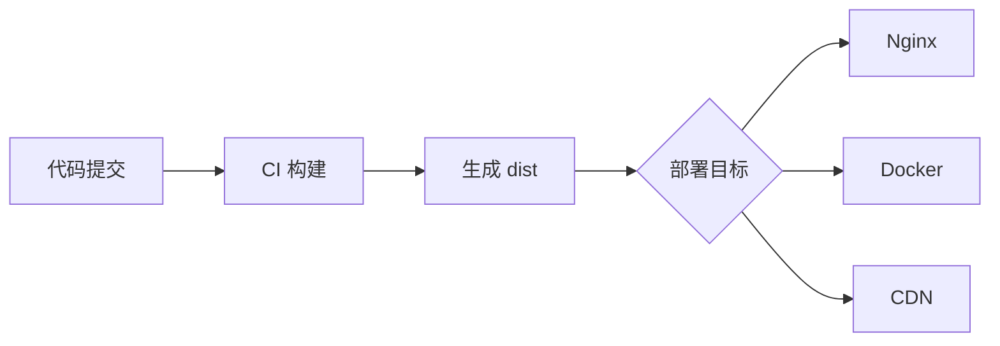

# 部署方案

md2ui 构建后是纯静态文件，可部署到任意静态服务器。

## 构建

```bash
pnpm build
```

构建产物在 `dist/` 目录。

## Nginx 部署

```nginx
server {
    listen 80;
    server_name docs.example.com;
    root /var/www/md2ui/dist;
    index index.html;

    # 支持 HTML5 History 模式
    location / {
        try_files $uri $uri/ /index.html;
    }

    # 静态资源缓存
    location ~* \.(js|css|png|jpg|jpeg|gif|ico|svg)$ {
        expires 30d;
        add_header Cache-Control "public, immutable";
    }
}
```

## Docker 部署

项目已包含 Dockerfile：

```bash
# 构建镜像
docker build -t md2ui .

# 运行容器
docker run -d -p 3000:3000 md2ui
```

## 部署流程



## GitHub Pages

1. 修改 `vite.config.js` 设置 base 路径：

```javascript
export default defineConfig({
  base: '/your-repo-name/'
})
```

2. 构建并推送到 gh-pages 分支

## Vercel / Netlify

直接连接 Git 仓库，自动构建部署，无需额外配置。
