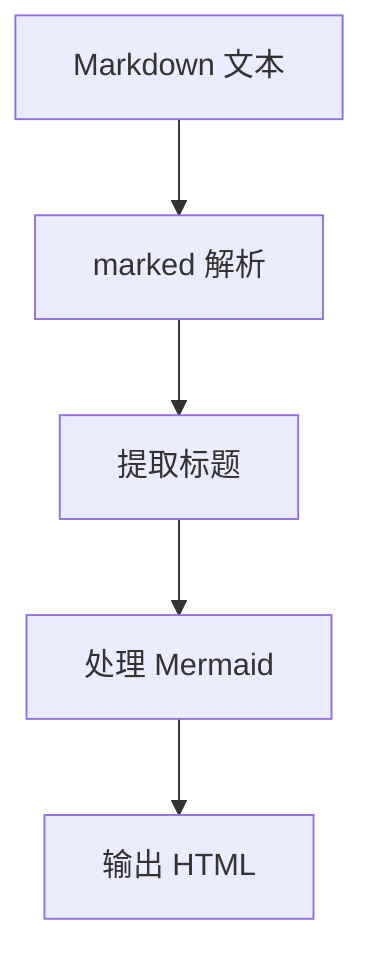

# Composables

md2ui 使用 Vue 3 Composition API，将可复用逻辑封装为 composables。

## useMarkdown

Markdown 渲染相关逻辑。

### 返回值

```javascript
const { 
  htmlContent,    // ref<string> - 渲染后的 HTML
  tocItems,       // ref<array> - 目录项列表
  renderMarkdown  // function - 渲染方法
} = useMarkdown()
```

### renderMarkdown

```javascript
// 渲染 Markdown 文本
await renderMarkdown(markdownText)
```

处理流程：



## useScroll

滚动相关逻辑。

### 返回值

```javascript
const {
  scrollProgress,  // ref<number> - 阅读进度 0-100
  showBackToTop,   // ref<boolean> - 是否显示返回顶部
  activeHeading,   // ref<string> - 当前高亮标题 ID
  handleScroll,    // function - 滚动事件处理
  scrollToHeading, // function - 跳转到标题
  scrollToTop      // function - 返回顶部
} = useScroll()
```

### 使用示例

```vue
<template>
  <main @scroll="handleScroll">
    <!-- 内容 -->
  </main>
  <button v-if="showBackToTop" @click="scrollToTop">
    返回顶部 {{ scrollProgress }}%
  </button>
</template>
```

## useResize

拖拽调整宽度逻辑。

### 返回值

```javascript
const {
  sidebarWidth,  // ref<number> - 侧边栏宽度
  tocWidth,      // ref<number> - 目录宽度
  startResize    // function - 开始拖拽
} = useResize()
```

### 使用示例

```vue
<template>
  <aside :style="{ width: sidebarWidth + 'px' }">
    <!-- 侧边栏 -->
  </aside>
  <div 
    class="resizer" 
    @mousedown="startResize('left', $event)"
  ></div>
</template>
```
